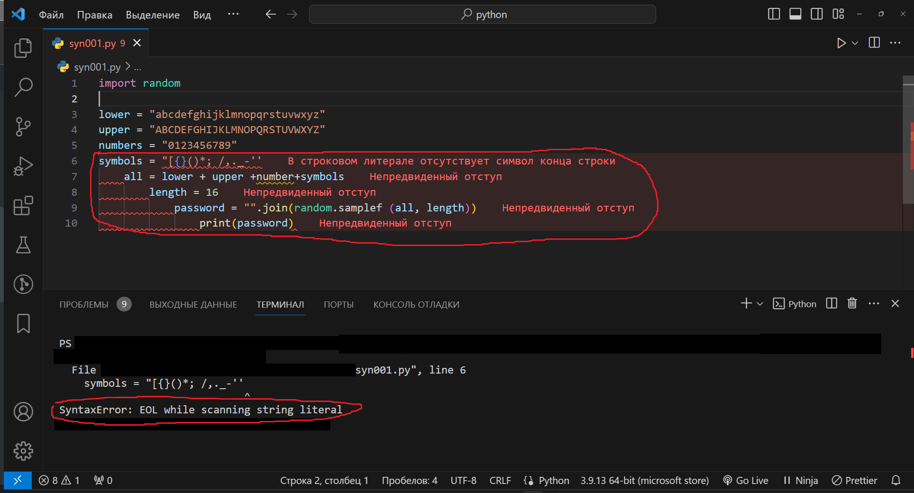

# Raport o blędzie

## Numer / identyfikator błędu
### Syn001

## Tytuł błędu
### Błąd składniowy w kodzie generującym hasło

## Priorytet
### Blokujący

## Platforma / środowisko
### Windows 11 Pro, VSCode v. 1.84.2, Python 3.9.13

## Opis
### W kodzie do generowania hasła występuje kilka błędów składniowych, które uniemożliwiają poprawne wykonanie programu.

## Kroki do reprodukcji
### - Uruchom skrypt zawierający kod. 
### - Zaobserwuj komunikaty o błędach generowanych przez interpreter Pythona.

## Oczekiwany i rzeczywisty wynik
### Oczekiwany wynik: Wygenerowanie bezbłędnego hasła składającego się z małych liter, dużych liter, cyfr i symboli.
### Rzeczywisty wynik: Błąd składniowy uniemożliwia poprawne wykonanie programu.

## Zrzut ekranu
